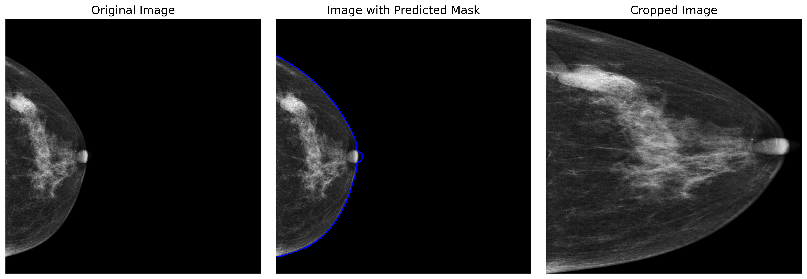
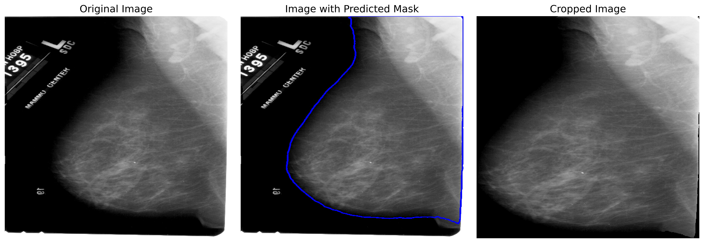

# Mammo Crop
## Description
This project involved adding additional segmentation labels to a small subset of images from six breast cancer classification datasets — CBIS-DDSM [1], CMMD [2], INbreast [3], KAU [4], MIAS [5], and VinDr [6]. The focus was on distinguishing breast tissue from the background, aiming to remove artifacts from the images and crop them, enabling further processing with any breast cancer diagnostic model.  This dataset was used for training the crop model in the paper described in [7]. You can find an example of the dataset and model usage in [example.ipynb](./example.ipynb).

## License
Each subset includes a license file that duplicates the original licenses from the dataset. Our model weights are published under the CC BY-NC 4.0 (Attribution-NonCommercial 4.0 International) license.

## Examples
### Image without Artifact

**Source:** `TheChineseMammographyDatabase/data/D1-0389/07-18-2010-NA-NA-81491/1.000000-NA-80813/1-1.dcm`

### Image with Artifact

**Source:** `CBIS_DDSM/data/Mass-Test_P_01348_LEFT_MLO/10-04-2016-DDSM-NA-59725/1.000000-full mammogram images-43418/1-1.dcm`

### Benefits of ROI Cropping
We can see that such cropping helps in several ways:
1. **Removal of Artifacts:** Cropping the region of interest helps eliminate unwanted artifacts, such as digits, labels, or other noise that may be present in the image but are unrelated to the breast tissue. These extraneous elements can negatively impact the performance of the neural network by introducing irrelevant information, which has no connection to the diagnosis.
2. **Enhanced Focus on Relevant Areas:** ROI cropping ensures that the model concentrates on the most important features, focusing exclusively on the breast area. Since the breast occupies the majority of the cropped image, this allows for more effective use of random crop augmentation and other geometrical transformations without the risk of losing crucial parts of the image for diagnosis prediction.
3. **Reduced Computational Load:** By cropping the image to focus on the breast, the network no longer needs to process black padding or irrelevant background areas. This allows the model to focus on larger and more detailed representations of the breast, improving the overall efficiency and effectiveness of the classification process.

## References
1. R. S. Lee, F. Gimenez, A. Hoogi, K. K. Miyake, M. Gorovoy, and D. L. Rubin, “A curated mammography data set for use in computer-aided detection and diagnosis research,” *Sci. Data*, vol. 4, no. 1, p. 170177, Dec. 2017.
2. C. Cui, L. Li, H. Cai, Z. Fan, L. Zhang, T. Dan, J. Li, and J. Wang, “The Chinese mammography database (CMMD): An online mammography database with biopsy-confirmed types for machine diagnosis of breast,” 2021.
3. I. C. Moreira, I. Amaral, I. Domingues, A. Cardoso, M. J. Cardoso, and J. S. Cardoso, “INbreast: toward a full-field digital mammographic database,” *Acad. Radiol.*, vol. 19, no. 2, pp. 236–248, Feb. 2012.
4. A. S. Alsolami, W. Shalash, W. Alsaggaf, S. Ashoor, H. Refaat, and M. Elmogy, “King Abdulaziz University breast cancer mammogram dataset (KAU-BCMD),” *Data (Basel)*, vol. 6, no. 11, p. 111, Oct. 2021.
5. J. Suckling, J. Parker, S. Astley, I. W. Hutt, C. R. M. Boggis, I. W. Ricketts, E. A. Stamatakis, N. Cerneaz, S. Kok, P. Taylor, D. Betal, and J. Savage, “The mammographic image analysis society digital mammogram database,” 1994. [Online]. Available: [https://api.semanticscholar.org/CorpusID:56649461](https://api.semanticscholar.org/CorpusID:56649461)
6. H. T. Nguyen, H. Q. Nguyen, H. H. Pham, K. Lam, L. T. Le, M. Dao, and V. Vu, “VinDr-Mammo: A large-scale benchmark dataset for computer-aided diagnosis in full-field digital mammography,” *Sci. Data*, vol. 10, no. 1, p. 277, May 2023.
7. A. Ibragimov, S. Senotrusova, A. Litvinov, E. Ushakov, E. Karpulevich, and Y. Markin, "MamT4: Multi-View Attention Networks for Mammography Cancer Classification," in *2024 IEEE 48th Annual Computers, Software, and Applications Conference (COMPSAC)*, pp. 1965-1970, 2024. doi: 10.1109/COMPSAC61105.2024.00313.
